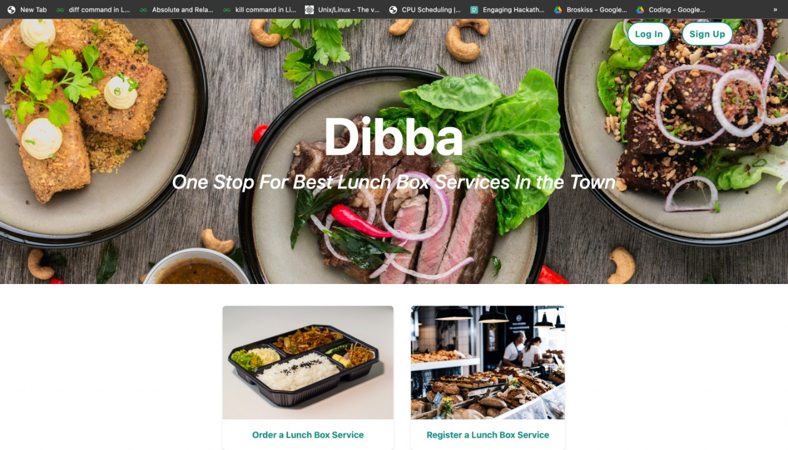
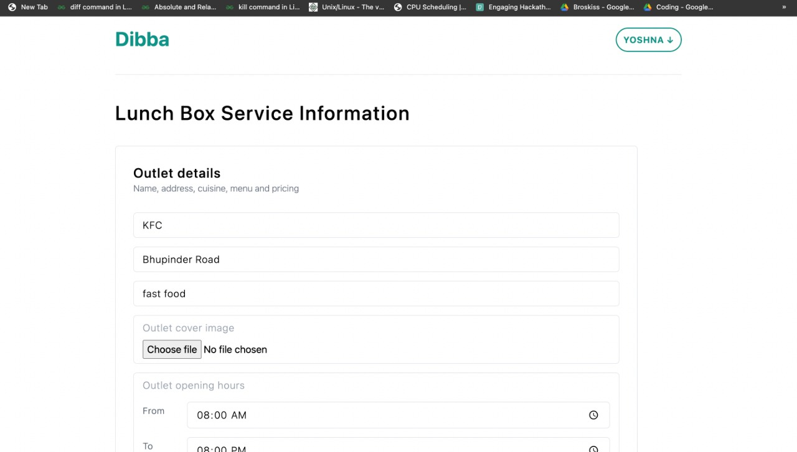
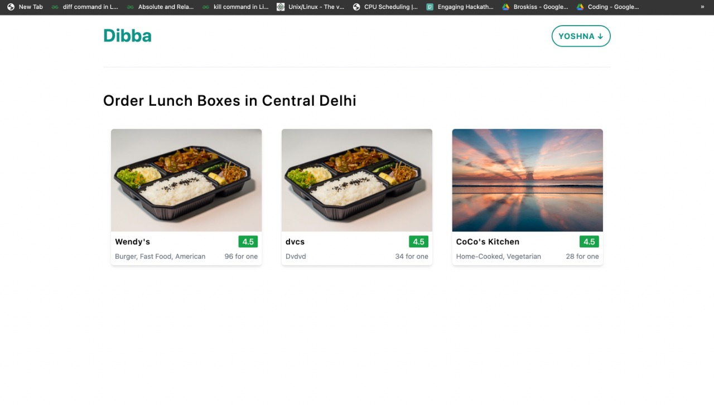
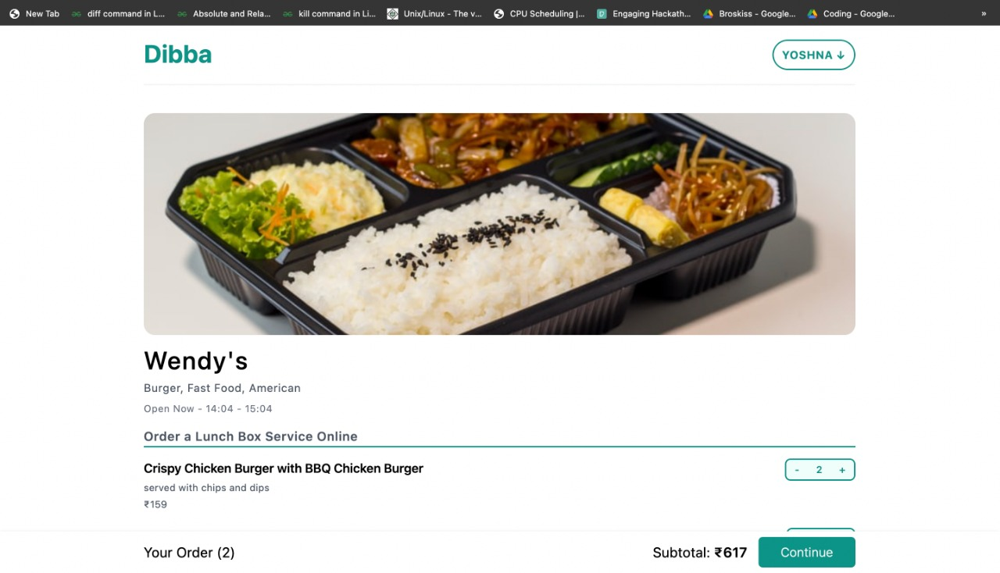
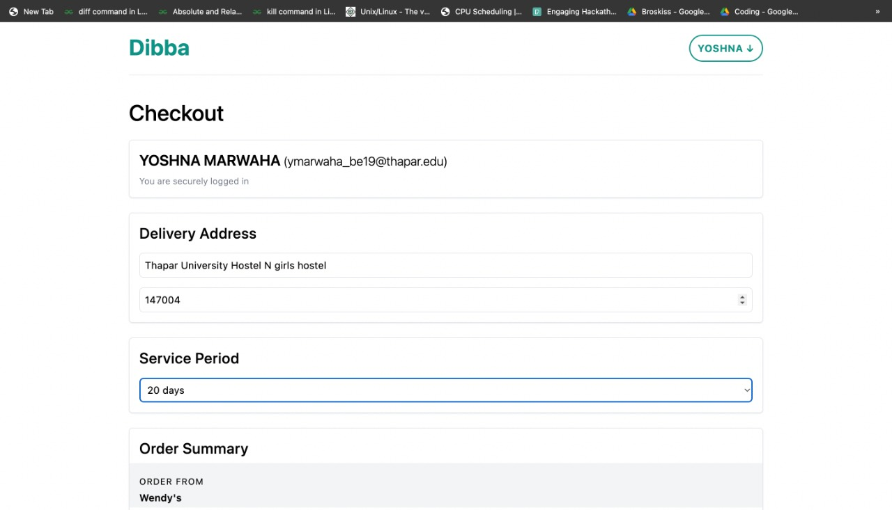
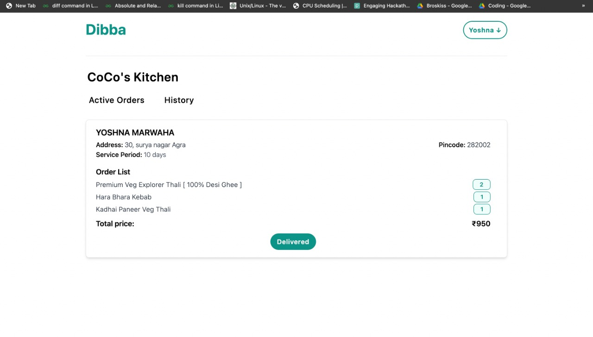
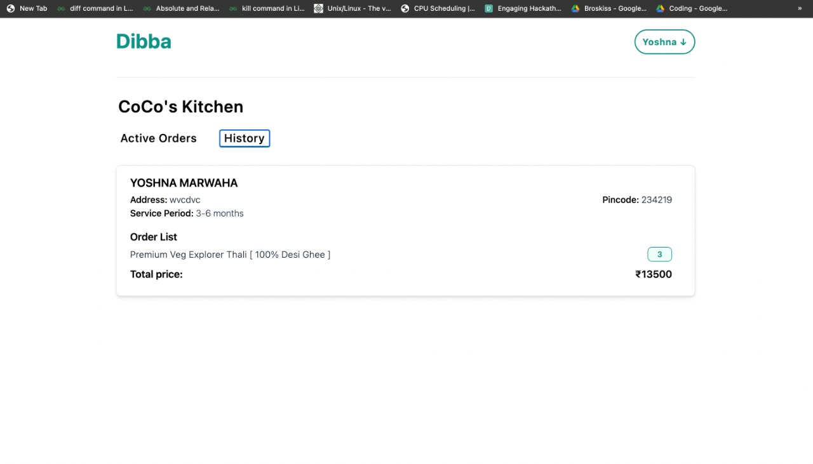

# Title: Dibba - One Stop For Lunch Box Services In Town

## 1. Methodology

<h1>

</h1>

## 2. Description

Dibba is one stop for lunch box services in a town. Since Covid a lot of households started their food services to provide better customer connectivity for them Dibba is made.
It is made using Next.js for server side rendering of pages and static site generation as it is better for SEO crawlers and has faster load time. This project has NO SQL database - MongoDB and Node js server.Styling is done using Tailwind CSS.
 
The user can register/login using Google OAuth and can then view various outlets and lunch box services and can order from them for a specific time period.The user can also register his own service and can view the outlets' orders and performance throughout the year.

## 3. Input / Output

User should Login or Signup with Google to be authenticated

## 4. Live Link

Link - https://dibba.vercel.app/

## 5. Screenshot of the Interface

### Landing page

<h1>

</h1>

### Register a new Lunch Box Outlet

<h1>

</h1>

### Lunch Box Services Page

<h1>

</h1>

<h1>

</h1>

### Checkout Page

<h1>

</h1>

### View Outlets' Active Orders and History

<h1>

</h1>

<h1>

</h1>
